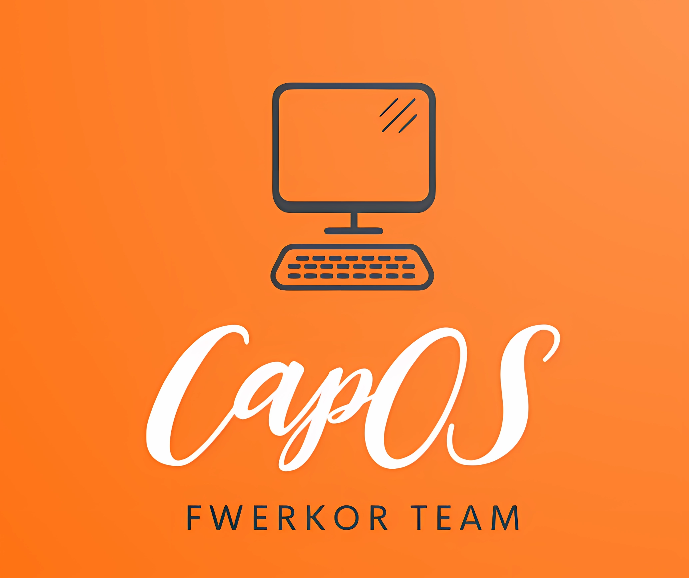

CapOS is an open source server operating system based on OpenWrt. It aims to provide an easy-to-use Linux server OS for beginners. CapOS utilizes the advantages of OpenWrt including the LuCI web-based management interface, to customize the development into a full-featured server OS.  

CapOS是一个基于OpenWrt的开源服务器操作系统。 它旨在为初学者提供易于使用的 Linux 服务器操作系统。 CapOS 利用 OpenWrt 的优势，包括 LuCI 基于 Web 的管理界面，定制开发成一个全功能的服务器操作系统。


Powered by FWERKOR Team, especially Castronaut. 


At present, this project is still in the initial stage of development, and there is no version available for the time being. 

***目前本项目还处于开发的起始阶段，暂时没有可用版本。***


***README文档仍在编辑中，敬请期待。***

## Features

CapOS is an lightweight open source server operating system derived from OpenWrt. It is designed to provide an easy-to-use Linux server experience for beginners. CapOS makes full use of the advantages of OpenWrt such as the LuCI web interface to develop into a fully functional server OS.

Some key highlights of CapOS:

* **Highly Lightweight**: CapOS is built from OpenWrt, an embedded operating system based on Linux. It has a small footprint that can run on various hardware from routers to PCs. The lightweight design allows CapOS to run smoothly even on devices with limited resources.

•**Friendly Web UI**: CapOS provides an simple but powerful web-based interface LuCI for easy server management. Users can easily manage system settings, monitor resources and install packages through the web UI without much Linux knowledge.  

•**Highly Extensible**: Although lightweight, CapOS is highly extensible. Users can install and run many server applications and packages on demand based on their needs. CapOS aims to strike a balance between being lightweight and practical.

•**Easy to Learn**: CapOS has a clean command line interface with standardized Linux commands to simplify operation. The automated and simplified CLI allows beginners to easily get started with CapOS.

•**Stable and Secure**: CapOS is developed based on OpenWrt, a secure and stable Linux system, with the latest kernel and software packages to ensure maximum security and stability.  

•**Runs on Various Hardware**: CapOS can run on popular hardware from routers, PCs to virtual machines. The lightweight design makes it possible to operate CapOS even on resource-constrained devices.  

•**Open Source**: CapOS is released under the GPL license. The open source community is welcome to contribute to make CapOS even more lightweight, extendable and user-friendly.

CapOS aims to provide beginners with an easy-to-use yet practical Linux server OS for learning and practice. The simplified web UI and CLI makes it easy to get started with CapOS. If you are looking for a lightweight but extensible Linux server solution, try CapOS! CapOS is open and free for all. Your feedback and suggestions will help us improve CapOS.

CapOS是一个基于OpenWrt的开源服务器操作系统。 它旨在为初学者提供易于使用的 Linux 服务器操作系统。 CapOS 利用 OpenWrt 的优势，包括 LuCI 基于 Web 的管理界面，定制开发成一个全功能的服务器操作系统。

CapOS 的一些关键特性：

•**友好的网络用户界面**：CapOS配备了一个简单但功能强大的基于网络的用户界面LuCI，这使得服务器管理对于初学者来说更加容易。 用户可以通过 Web UI 轻松管理系统设置、监控资源和安装软件包。

•**轻量级和可扩展性**：CapOS 由基于Linux 的嵌入式操作系统OpenWrt 构建而成。 它是轻量级的而且具有高度的可扩展性，用户可以根据需要安装许多服务器应用程序和包。

•**易于学习**：CapOS 为用户提供了一个简单干净的命令行界面。 加强了标准的 Linux 命令和自动化，以简化操作和维护。

•**稳定安全**：CapOS基于安全稳定的Linux系统OpenWrt开发。 配备最新的Linux内核和软件包，确保系统安全稳定。

•**开源**：CapOS 在GPL 许可下发布。 欢迎开源社区为这个项目做出贡献，让 CapOS 更好地为用户服务。

CapOS旨在为初学者提供一个简单易用的Linux服务器系统，用于自学和实践。 图形化的 Web UI 和标准化的 CLI 都可以帮助初学者轻松上手 CapOS。 如果您对 Linux 服务器感兴趣，欢迎尝试！ CapOS 对所有人开放且免费。 非常感谢您的反馈和建议，以帮助我们改进 CapOS。

## Download

Generally speaking, the server of the FWERKOR team will automatically obtain the source code from Github and compile it every once in a while. The compiled version will be available for viewing and downloading in *FR-REPO*

通常来说，FWERKOR团队的服务器会每隔一段时间自动从Github获取源代码并进行编译，编译完成后的版本将可以在*FR-REPO*查看并下载

* [FR-REPO](https://repo.fwerkor.com/)


## 

An advanced user may require additional or specific package. (Toolchain, SDK, ...) For everything else than simple firmware download, try the wiki download page:

* [OpenWrt Wiki Download](https://openwrt.org/downloads)

## Development

To build your own firmware you need a GNU/Linux, BSD or MacOSX system (case
sensitive filesystem required). Cygwin is unsupported because of the lack of a
case sensitive file system.

### Requirements

You need the following tools to compile OpenWrt, the package names vary between
distributions. A complete list with distribution specific packages is found in
the [Build System Setup](https://openwrt.org/docs/guide-developer/build-system/install-buildsystem)
documentation.

```
binutils bzip2 diff find flex gawk gcc-6+ getopt grep install libc-dev libz-dev
make4.1+ perl python3.7+ rsync subversion unzip which
```

### Quickstart

1. Run `./scripts/feeds update -a` to obtain all the latest package definitions
   defined in feeds.conf / feeds.conf.default

2. Run `./scripts/feeds install -a` to install symlinks for all obtained
   packages into package/feeds/

3. Run `make menuconfig` to select your preferred configuration for the
   toolchain, target system & firmware packages.

4. Run `make` to build your firmware. This will download all sources, build the
   cross-compile toolchain and then cross-compile the GNU/Linux kernel & all chosen
   applications for your target system.

### Related Repositories

The main repository uses multiple sub-repositories to manage packages of
different categories. All packages are installed via the OpenWrt package
manager called `opkg`. If you're looking to develop the web interface or port
packages to OpenWrt, please find the fitting repository below.

* [LuCI Web Interface](https://github.com/openwrt/luci): Modern and modular
  interface to control the device via a web browser.

* [OpenWrt Packages](https://github.com/openwrt/packages): Community repository
  of ported packages.

* [OpenWrt Routing](https://github.com/openwrt/routing): Packages specifically
  focused on (mesh) routing.

* [OpenWrt Video](https://github.com/openwrt/video): Packages specifically
  focused on display servers and clients (Xorg and Wayland).

## Support Information

For a list of supported devices see the [OpenWrt Hardware Database](https://openwrt.org/supported_devices)

### Documentation

* [Quick Start Guide](https://openwrt.org/docs/guide-quick-start/start)
* [User Guide](https://openwrt.org/docs/guide-user/start)
* [Developer Documentation](https://openwrt.org/docs/guide-developer/start)
* [Technical Reference](https://openwrt.org/docs/techref/start)

### Community

* [Github Issues](https://github.com/fwerkor/capos/Issues): For bug feedback, feature update suggestions. 
* [FWERKOR Blog](https://blog.fwerkor.com): You can comment below the article. 
* 

## License

CapOS is licensed under GPL-2.0
